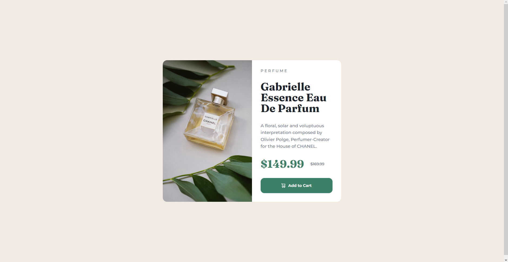

# Frontend Mentor - Product preview card component solution

This is a solution to the [Product preview card component challenge on Frontend Mentor](https://www.frontendmentor.io/challenges/product-preview-card-component-GO7UmttRfa). Frontend Mentor challenges help you improve your coding skills by building realistic projects. 

## Table of contents

- [Overview](#overview)
  - [The challenge](#the-challenge)
  - [Screenshot](#screenshot)
  - [Links](#links)
- [My process](#my-process)
  - [Built with](#built-with)
  - [Useful resources](#useful-resources)
- [Author](#author)

## Overview

### The challenge

Users should be able to:

- View the optimal layout depending on their device's screen size
- See hover and focus states for interactive elements

### Screenshot

### Links

- Live Site URL: [Add live site URL here](https://incandescent-kitsune-ad5fc1.netlify.app)

## My process

### Built with

- Semantic HTML5 markup
- CSS custom properties
- Flexbox
- Mobile-first workflow

### Useful resources

- [HTML Picture tag](https://www.w3schools.com/tags/tag_picture.asp) - Since it has somewhat unique attributes, it is easy to forget how to use `picture`{.html} tag.
- [Complete guide to Flexbox](https://css-tricks.com/snippets/css/a-guide-to-flexbox/) - Despite me using `display: grid`{.css} for the main container, flexbox has lower degree of entry and therefore, its easier to use. Nonetheless, you still need to learn it😊.

## Author

- Website - [Kirill Chekmenev](https://www.your-site.com)
- Frontend Mentor - [@chirikchekmen](https://www.frontendmentor.io/profile/chirikchekmen)
